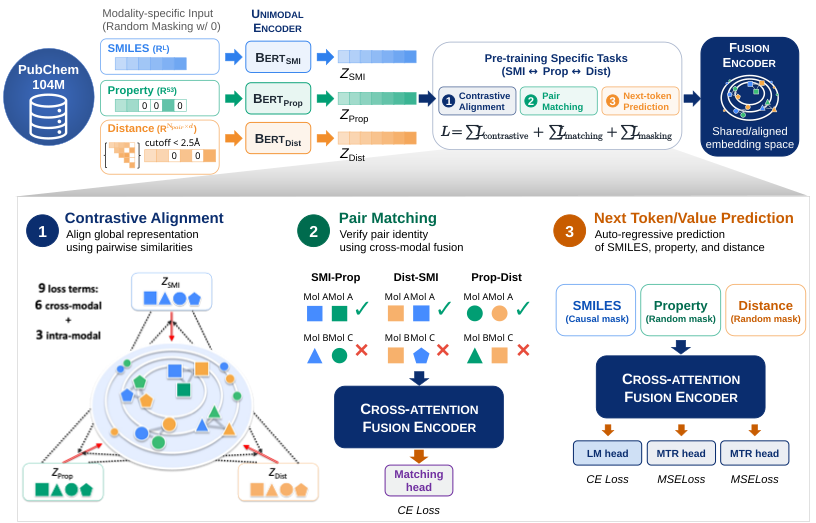

# TriSPD: A Trimodal Molecular Foundation Model Integrating Structure, Properties, and Local Geometry for Human Pharmacokinetic Prediction

<p align="center">
  
</p>

Pre-training dataset and checkpoints:

[](https://doi.org/10.5281/zenodo.22227052)

The fine-tuning PK dataset is not redistributed here. It can be downloaded from
the Supporting Information of the Iwata et al. reference: [https://doi.org/10.1021/acs.jcim.2c00318].

---

## 1. Set environment

[TODO]

## 2. Preparing the pre-training data

Each molecule is stored as a canonical SMILES string, a normalized property
vector, and — for the 3D branch — an atom-pair list with the corresponding
interatomic distances taken from a 3D distance matrix.

```bash
python create_lmdb.py --input_file src/Pretrain/test_sample.txt --output_file src/Pretrain/test_sample.lmdb
```

The SMILES corpus and the checkpoints actually used in the paper
(`train_smiles.txt`, `valid_smiles.txt`, and the `.ckpt` files) are on Zenodo at
the DOI above.

## 3. Pre-training

Train the trimodal model on the LMDB produced in the previous step.

```bash
python SPMM_pretrain_tri.py \
    --batch_size 96 --num_workers 8 --devices 5 \
    --input_file src/Pretrain/test_sample.lmdb
```

## 4. Representational analysis

Compares a bimodal and a trimodal checkpoint on the same molecules: effective
rank, CKA, distance-modality coverage, and layer-wise cross-model CKA.

```bash
python run_bivstri.py \
    --num_samples 100 --val_lmdb src/Pretrain/test_sample.lmdb \
    --bi_ckpt  Pretrain/bi_random/bimodal_pubchem100m_96_step=216260.ckpt \
    --tri_ckpt Pretrain/tri_random/trimodal_pubchem100m_96_step=216260.ckpt
```

## 5. Zero-shot tasks

**Property-vector prediction**

```bash
python pv_predict.py \
    --input_file src/Pretrain/test_sample.lmdb \
    --checkpoint Pretrain/tri_random/trimodal_pubchem100m_96_step=216260.ckpt
```

**SMILES generation**

```bash
python gen_smiles.py \
    --k_list 5,10 --n_mols 1000 --test_file src/Pretrain/test_sample.txt --batch_size 512 \
    --checkpoint Pretrain/tri_random/trimodal_pubchem100m_96_step=216260.ckpt \
    --out_csv ./gensmiles_tri.csv
```

## 6. Fine-tuning for human PK prediction

> **NOTE**  `test_sample_pk.csv` is a dummy file that only shows the expected
> format. To reproduce the reported results, download the source data from the
> Iwata et al. Supporting Information and pass it with `--input`.

### 6.1 Extract frozen features

Runs the frozen text encoder once and writes the embeddings to a `.npz` cache,
one file per (checkpoint, target, split).

```bash
python ft_extract_feature.py \
    --checkpoints Pretrain/trimodal_pubchem100m_96_step=216260.ckpt \
                  Pretrain/trimodal_pubchem100m_96_step=173008.ckpt \
    --target_name human_CL --input src/Finetuning/test_sample_pk.csv
```

### 6.2 Train the prediction head

Trains an endpoint predictor on the cached frozen features.

```bash
python ft_regression.py \
    --target_name human_CL --input src/Finetuning/test_sample_pk.csv \
    --warmup_mode gradual --num_seeds 100 \
    --checkpoints Pretrain/trimodal_pubchem100m_96_step=173008.ckpt \
                  Pretrain/trimodal_pubchem100m_96_step=216260.ckpt \
    --tag tri --ratios 0 0.25 0.5 0.75 1.0
```

### Input format

The fine-tuning CSV must contain these 12 columns. A missing column raises
`KeyError`; empty cells are allowed where noted.

| Column | Notes |
|---|---|
| `mol` | SMILES, parsed and re-canonicalised with RDKit |
| `monkey_CL`, `monkey_VDss`, `monkey_fup` | invivo PK for monkey with missing value |
| `dog_CL`, `dog_VDss`, `dog_fup` | invivo PK for dog with missing value |
| `rat_CL`, `rat_VDss`, `rat_fup` | invivo PK for rat with missing value |
| target, e.g. `human_CL` | rows with an empty target are dropped |
| split, e.g. `CL_set` | `Train` or `Valid` |

The split column name is derived from the target: `--target_name human_CL`
reads `CL_set`. Any other column is ignored and may be kept or removed.

Animal PK is sparse in practice, and the animal encoder has a learned embedding
for missing cells, so molecules with gaps are still used. A column that is empty
for *every* training row is different: the scaler median is undefined, the
column becomes all-NaN, and it stops carrying information. Keep at least a few
observed values per animal column in each split.

`CL` and `VDss` columns are log10-transformed internally, so store them in
linear units.

---

## Citation


## Acknowledgements

TriSPD builds on SPMM (https://github.com/jinhojsk515/SPMM):

> Chang, J. & Ye, J. C. Bidirectional generation of structure and properties
> through a single molecular foundation model. *Nature Communications* (2024).
